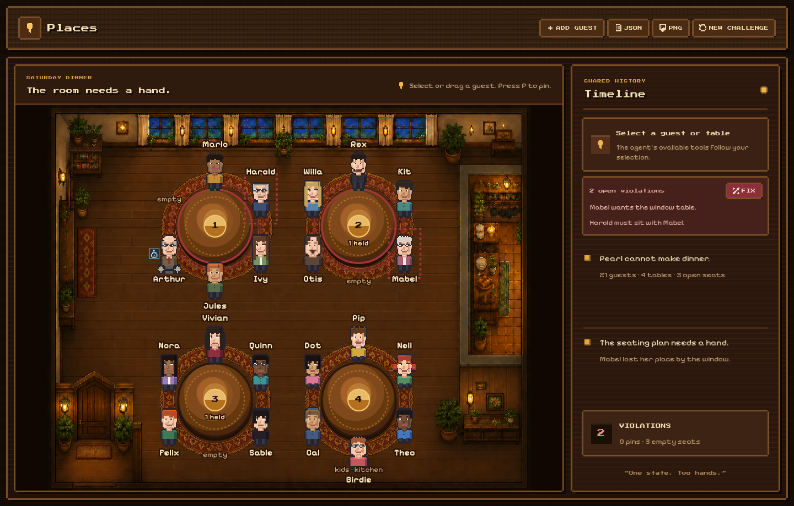
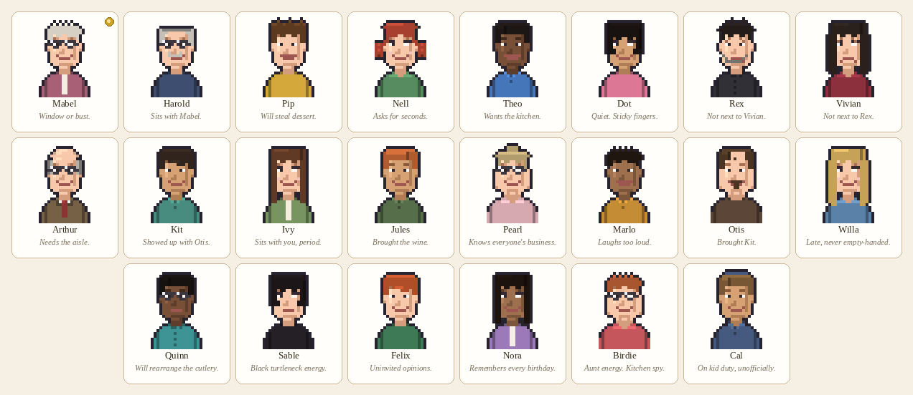

<div align="center">


# Places

**A shared seating chart. You pin. The agent reflows the rest.**



[Live demo](https://places.mateolafalce.chatgpt.site) · [WebMCP Challenge](https://openai.com/webmcp-challenge/)

<p>
  <a href="https://github.com/mateolafalce/places/actions/workflows/ci.yml"></a>
  
  
  
  
</p>

</div>

A family dinner, a workshop, a small wedding: the pain is a spreadsheet and an argument. The agent is good at constraints. The person is good at “Mabel stays at the window, period.”

Places is one room in the browser. Drag and pin on the floorplan. The agent never scrapes the DOM — it only sees WebMCP tools, and those tools **appear and disappear** with your selection and pins. Every write goes through the same `executeCommand()` the UI uses, so a tool call moves a place-card on the SVG you are looking at.

No backend, no login, no API key. State lives in the tab. Export JSON or PNG when you want a copy.

Open the live demo in ChatGPT’s in-app browser (WebMCP is on by default) or in Chrome with `chrome://flags/#enable-webmcp-testing`.

## Try it with an agent

The room loads already messy: 22 guests, one absent, four tables, two held empty seats, and at least one broken rule. You do not start from a blank grid.

1. Pin **Mabel** at the window table (click her, then **Pin this seat**, or press `P` while she is focused).
2. Paste:

   > Read the room. Fix every seating violation you can. Do not move anyone I pinned.

3. Watch the timeline. Mabel does not move. Unpinned guests reflow. Tables in red clear, or the tool returns `blocked_by_pins` if a pin still blocks a preference.

Then try a last-minute arrival:

> Add a plus-one named Rowan and reseat around the held empty chairs. Still do not move pinned guests.

Human controls still work if `document.modelContext` is missing. The badge in the header says so.

## Why this is a WebMCP app

**Fit.** WebMCP is a capability bus for a live page, not a cart API. Pins, wheelchair aisle seats, and “do not sit together” pairs are page state. Scraping the SVG drops them. The agent has to call tools, and the tool list itself is part of the contract: select a table and `seat_guest_here` exists; pin that guest and `move_guest` is gone.

**Better experience.** You stop redrawing the chart after every plus-one. You pin the two or three seats that are non-negotiable and let the agent repair the rest. Each call is a visible move on the same canvas, with a one-line entry in the timeline.

**What was hard before.** A constraint solver dumps a list. A group chat dumps an argument. Neither could keep a live room, a pin the agent cannot violate, and a reflow in one place. Places does, because the page is ground truth for both hands.

**How it is implemented.** `document.modelContext.registerTool` for a stable set (`get_room_state`, `list_violations`, `explain_guest`, `add_guest`). Selection, pins, and open violations abort the previous `AbortController` and register the tools that make sense now. Writes go through `executeCommand()` in `web/lib/places/domain.ts`. If a move hits a pin, the command returns `pinned_by_human` and the sprite does not move.

```
        you ── pin / drag ──►  ┌──────────────────┐
                               │      Room        │  SVG canvas
                               │   (ground truth) │  tables · chairs · pins
                               │ executeCommand() │  violations in red
                               └────────┬─────────┘
                                        │
             ┌──────────────────────────┼──────────────────────────┐
             ▼                          ▼                          ▼
       ┌───────────┐             ┌───────────┐             ┌───────────┐
       │  Human UI │             │  WebMCP   │   tools     │   Agent   │
       │ drag, pin │             │  register │ ◄────────── │  ChatGPT  │
       │ plus-one  │             │  / abort  │             │           │
       └───────────┘             └───────────┘             └───────────┘
             │                          ▲                          │
             └──────── one state ───────┴──── toolchange ──────────┘
```

## Tools

Always on:

| Tool | What it does |
|---|---|
| `get_room_state` | Tables, seats, pins, selection, violations |
| `list_violations` | What is wrong and why |
| `explain_guest` | Where someone sits, whether they are pinned, which rules apply |
| `add_guest` | Seat a last-minute guest in a held empty chair |

Registered with the current selection, then aborted when it changes:

| When | Tools |
|---|---|
| A table is selected | `seat_guest_here`, `set_capacity`, `leave_empty_seats` |
| An unpinned guest is selected | `pin_guest`, `move_guest`, `swap_guests` |
| A pinned guest is selected | `unpin_guest` only — `move_guest` is not registered |
| The room has violations | `fix_violations` (never moves pins; may return `blocked_by_pins`) |

There is no always-on `move_guest(guestId, tableId)`. The agent reflows with `fix_violations`, or acts on whoever you have selected. That is the point: you choose the contract, the agent works inside it.

## The Orchard House Saturday

A fictional dinner used as a concrete seed, not a CSV of Guest 1–22. Pixel-art people sit at four tables. Relationships are the rules; the sprite is how you find them.



| Rule | Who | Severity |
|---|---|---|
| Window table | **Mabel** | preference |
| Sit together | **Harold** with Mabel; **Kit** with Otis | hard |
| Do not share a table | **Rex** × **Vivian** | hard |
| Kitchen table | **Pip**, **Nell**, **Theo**, **Dot** | preference |
| Accessible aisle seat | **Arthur** | hard |
| Hold empty chairs | two seats reserved for late arrivals | hard |

Each load picks one of four opening problems (rivals seated together, a split plus-one, Mabel off the window, a kid off the kitchen) and one guest who could not make it. **New challenge** rerolls that seed.

## Run locally

Node 22.13 or newer. From `web/`:

```bash
npm ci
npm run dev
```

Then:

```bash
npm test          # seating rules, pins, reflow
npm run typecheck
npm run lint
npm run format:check
```

`npm run build` produces the Cloudflare-compatible worker; `npm start` serves it with Wrangler.
Pull requests run tests, type checking, linting, and formatting checks in GitHub
Actions. Dependabot checks the npm application weekly and GitHub Actions
monthly.

## License

[MIT](./LICENSE)
